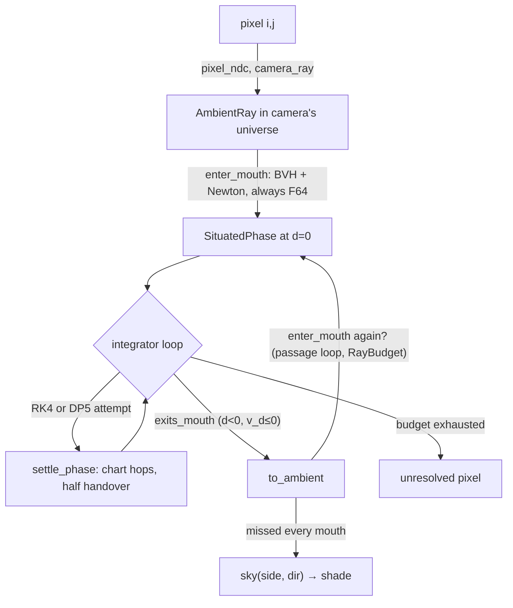

# Atlas — a map of the jupiter code

For the reader who wants to inject sanity: what the mathematical objects are,
what they're called in code, how a ray flows through the files, which pieces
are twins of which, and where precision lives. This is the cross-file layer
that per-file comments can't carry. Update when structure changes (file
layout, twin/oracle relationships), not for routine edits.

## The object being rendered

A wormhole between flat "ambient" spaces. The throat is a compact
surface S ⊂ ℝ³ (cube or trefoil so far) thickened inward: two copies
("halves", one per mouth) of a collar neighborhood of S, glued to each other
at depth. Each half carries an affine `Placement` embedding its mouth in an
ambient flat space. Conceptually the two ambient spaces need not be distinct
— the placements are exactly the freedom to put both mouths in one room.
The code currently identifies ambient space with the side index, though:
`Scene` keys one mouth and the sky per side, and a ray exiting side s only
ever tests re-entry against `scene.mouths[s]` (render.jl), so a co-placed
second mouth would be invisible to it — the shared-space case is the
standing multi-mouth item (nearest-entry selection across mouths). A ray
leaves a mouth, may thread the throat several times ("passages"), and
eventually escapes into an ambient space, where a sky texture shades it. Light = geodesics of a
Riemannian metric g built so it's exactly the flat pullback near the mouth
(seamless handoff to straight ambient rays) and exactly a product cylinder
metric deep inside (so the two halves glue isometrically).

## Coordinates: the math-to-code dictionary

**Mesh** (`meshy.jl`) — closed quad mesh, half-edge connectivity in flat
id-indexed arrays (GPU-shaped). A vertex's *canonical handle* is its
outgoing half-edge toward the first neighbor in encounter order;
`half_edge_offset` counts outgoing half-edges ccw from it. Everything
downstream (chart frames, wedge numbering) is anchored to that gauge choice,
which is deterministic by construction — never a hash-iteration accident.

**Chart** (`throat.jl`, `chart.jl`) — every vertex owns a chart: a
neighborhood of the origin in the (u,v) plane, Ying–Zorin style. A valence-n
vertex sees its n incident faces as n angular *wedges* of width 2π/n. The
conformal map z ↦ z^(n/4) (z = u+iv) opens a wedge into a quadrant:
`wedge_square_coords(n, k, pos)` = √2·(e^{−2πik/n}·z)^(n/4) sends wedge k to
the unit square of its face ([0,1]², u along the wedge's starting edge,
vertex at the origin); `square_coords_to_chart` inverts it. All of this is
built from `fake_complex_pow`/`safe_atan2` — principal complex power from
AD-friendly real primitives. A phase is "comfortable" in a chart while its
face square coords stay in [0, 1/2]² — beyond that, `settle_phase` hops to a
neighboring chart (`chart_transition`: rotate to the shared edge, cross via
`wedge_map` = z^(n/4) composed with reflection and z^(4/m), rotate into the
neighbor's canonical frame).

<svg viewBox="0 0 780 430" width="100%" style="max-width:780px" xmlns="http://www.w3.org/2000/svg" role="img" aria-label="Chart wedge structure at valence 4 and valence 7" font-family="system-ui, sans-serif">
<circle cx="195.0" cy="235.0" r="130.0" fill="none" stroke="currentColor" stroke-opacity="0.15" stroke-width="1"/>
<path d="M195.0 235.0L204.2 235.0L213.4 235.0L222.6 235.0L231.8 235.0L241.0 235.0L250.2 235.0L259.3 235.0L268.5 235.0L277.7 235.0L286.9 235.0L286.9 225.8L286.9 216.6L286.9 207.4L286.9 198.2L286.9 189.0L286.9 179.8L286.9 170.7L286.9 161.5L286.9 152.3L286.9 143.1L277.7 143.1L268.5 143.1L259.3 143.1L250.2 143.1L241.0 143.1L231.8 143.1L222.6 143.1L213.4 143.1L204.2 143.1L195.0 143.1L195.0 152.3L195.0 161.5L195.0 170.7L195.0 179.8L195.0 189.0L195.0 198.2L195.0 207.4L195.0 216.6L195.0 225.8L195.0 235.0Z" fill="currentColor" fill-opacity="0.07" stroke="none"/>
<path d="M195.0 235.0L204.2 235.0L213.4 235.0L222.6 235.0L231.8 235.0L241.0 235.0L250.2 235.0L259.3 235.0L268.5 235.0L277.7 235.0L286.9 235.0L286.9 225.8L286.9 216.6L286.9 207.4L286.9 198.2L286.9 189.0L286.9 179.8L286.9 170.7L286.9 161.5L286.9 152.3L286.9 143.1L277.7 143.1L268.5 143.1L259.3 143.1L250.2 143.1L241.0 143.1L231.8 143.1L222.6 143.1L213.4 143.1L204.2 143.1L195.0 143.1L195.0 152.3L195.0 161.5L195.0 170.7L195.0 179.8L195.0 189.0L195.0 198.2L195.0 207.4L195.0 216.6L195.0 225.8L195.0 235.0Z" fill="none" stroke="currentColor" stroke-opacity="0.45" stroke-width="0.9"/>
<path d="M195.0 235.0L195.0 225.8L195.0 216.6L195.0 207.4L195.0 198.2L195.0 189.0L195.0 179.8L195.0 170.7L195.0 161.5L195.0 152.3L195.0 143.1L185.8 143.1L176.6 143.1L167.4 143.1L158.2 143.1L149.0 143.1L139.8 143.1L130.7 143.1L121.5 143.1L112.3 143.1L103.1 143.1L103.1 152.3L103.1 161.5L103.1 170.7L103.1 179.8L103.1 189.0L103.1 198.2L103.1 207.4L103.1 216.6L103.1 225.8L103.1 235.0L112.3 235.0L121.5 235.0L130.7 235.0L139.8 235.0L149.0 235.0L158.2 235.0L167.4 235.0L176.6 235.0L185.8 235.0L195.0 235.0Z" fill="none" stroke="currentColor" stroke-opacity="0.45" stroke-width="0.9"/>
<path d="M195.0 235.0L185.8 235.0L176.6 235.0L167.4 235.0L158.2 235.0L149.0 235.0L139.8 235.0L130.7 235.0L121.5 235.0L112.3 235.0L103.1 235.0L103.1 244.2L103.1 253.4L103.1 262.6L103.1 271.8L103.1 281.0L103.1 290.2L103.1 299.3L103.1 308.5L103.1 317.7L103.1 326.9L112.3 326.9L121.5 326.9L130.7 326.9L139.8 326.9L149.0 326.9L158.2 326.9L167.4 326.9L176.6 326.9L185.8 326.9L195.0 326.9L195.0 317.7L195.0 308.5L195.0 299.3L195.0 290.2L195.0 281.0L195.0 271.8L195.0 262.6L195.0 253.4L195.0 244.2L195.0 235.0Z" fill="none" stroke="currentColor" stroke-opacity="0.45" stroke-width="0.9"/>
<path d="M195.0 235.0L195.0 244.2L195.0 253.4L195.0 262.6L195.0 271.8L195.0 281.0L195.0 290.2L195.0 299.3L195.0 308.5L195.0 317.7L195.0 326.9L204.2 326.9L213.4 326.9L222.6 326.9L231.8 326.9L241.0 326.9L250.2 326.9L259.3 326.9L268.5 326.9L277.7 326.9L286.9 326.9L286.9 317.7L286.9 308.5L286.9 299.3L286.9 290.2L286.9 281.0L286.9 271.8L286.9 262.6L286.9 253.4L286.9 244.2L286.9 235.0L277.7 235.0L268.5 235.0L259.3 235.0L250.2 235.0L241.0 235.0L231.8 235.0L222.6 235.0L213.4 235.0L204.2 235.0L195.0 235.0Z" fill="none" stroke="currentColor" stroke-opacity="0.45" stroke-width="0.9"/>
<path d="M241.0 235.0L241.0 227.3L241.0 219.7L241.0 212.0L241.0 204.4L241.0 196.7L241.0 189.0L233.3 189.0L225.6 189.0L218.0 189.0L210.3 189.0L202.7 189.0L195.0 189.0L195.0 189.0L187.3 189.0L179.7 189.0L172.0 189.0L164.4 189.0L156.7 189.0L149.0 189.0L149.0 196.7L149.0 204.4L149.0 212.0L149.0 219.7L149.0 227.3L149.0 235.0L149.0 235.0L149.0 242.7L149.0 250.3L149.0 258.0L149.0 265.6L149.0 273.3L149.0 281.0L156.7 281.0L164.4 281.0L172.0 281.0L179.7 281.0L187.3 281.0L195.0 281.0L195.0 281.0L202.7 281.0L210.3 281.0L218.0 281.0L225.6 281.0L233.3 281.0L241.0 281.0L241.0 273.3L241.0 265.6L241.0 258.0L241.0 250.3L241.0 242.7L241.0 235.0Z" fill="none" stroke="currentColor" stroke-opacity="0.55" stroke-width="1" stroke-dasharray="4 3"/>
<line x1="195.0" y1="235.0" x2="286.9" y2="235.0" stroke="currentColor" stroke-width="3.0" stroke-opacity="0.9"/>
<text x="341.9" y="227.0" text-anchor="middle" font-size="11" fill="currentColor" fill-opacity="0.75">0</text>
<line x1="195.0" y1="235.0" x2="195.0" y2="143.1" stroke="currentColor" stroke-width="1.6" stroke-opacity="0.9"/>
<text x="195.0" y="92.1" text-anchor="middle" font-size="11" fill="currentColor" fill-opacity="0.75">1</text>
<line x1="195.0" y1="235.0" x2="103.1" y2="235.0" stroke="currentColor" stroke-width="1.6" stroke-opacity="0.9"/>
<text x="48.1" y="239.0" text-anchor="middle" font-size="11" fill="currentColor" fill-opacity="0.75">2</text>
<line x1="195.0" y1="235.0" x2="195.0" y2="326.9" stroke="currentColor" stroke-width="1.6" stroke-opacity="0.9"/>
<text x="195.0" y="385.9" text-anchor="middle" font-size="11" fill="currentColor" fill-opacity="0.75">3</text>
<text x="266.7" y="167.3" text-anchor="middle" font-size="10" font-style="italic" fill="currentColor" fill-opacity="0.6">k=0</text>
<text x="123.3" y="167.3" text-anchor="middle" font-size="10" font-style="italic" fill="currentColor" fill-opacity="0.6">k=1</text>
<text x="123.3" y="310.7" text-anchor="middle" font-size="10" font-style="italic" fill="currentColor" fill-opacity="0.6">k=2</text>
<text x="266.7" y="310.7" text-anchor="middle" font-size="10" font-style="italic" fill="currentColor" fill-opacity="0.6">k=3</text>
<line x1="286.9" y1="235.0" x2="366.6" y2="235.0" stroke="currentColor" stroke-opacity="0.35" stroke-width="1" stroke-dasharray="2 3"/>
<text x="374.4" y="239.0" font-size="12" fill="currentColor" fill-opacity="0.8">u</text>
<line x1="195.0" y1="143.1" x2="195.0" y2="63.4" stroke="currentColor" stroke-opacity="0.35" stroke-width="1" stroke-dasharray="2 3"/>
<text x="195.0" y="55.6" text-anchor="middle" font-size="12" fill="currentColor" fill-opacity="0.8">v</text>
<text x="234.0" y="251.0" font-size="10" fill="currentColor" fill-opacity="0.8">canonical (offset 0)</text>
<text x="195.0" y="41.4" text-anchor="middle" font-size="13" font-weight="600" fill="currentColor">valence n = 4</text>
<circle cx="575.0" cy="235.0" r="130.0" fill="none" stroke="currentColor" stroke-opacity="0.15" stroke-width="1"/>
<path d="M575.0 235.0L603.6 235.0L617.5 235.0L628.6 235.0L638.2 235.0L646.8 235.0L654.6 235.0L662.0 235.0L668.9 235.0L675.4 235.0L681.6 235.0L681.8 228.9L682.2 222.9L682.8 216.9L683.6 211.0L684.7 205.2L685.9 199.6L687.3 194.1L688.8 188.8L690.4 183.6L692.1 178.6L687.1 176.8L682.1 174.8L677.0 172.7L671.8 170.3L666.7 167.8L661.5 165.0L656.4 162.0L651.3 158.8L646.3 155.3L641.5 151.6L637.6 156.5L633.5 161.6L629.2 167.0L624.7 172.7L619.7 178.9L614.4 185.6L608.4 193.1L601.5 201.8L592.8 212.6L575.0 235.0Z" fill="currentColor" fill-opacity="0.07" stroke="none"/>
<path d="M575.0 235.0L603.6 235.0L617.5 235.0L628.6 235.0L638.2 235.0L646.8 235.0L654.6 235.0L662.0 235.0L668.9 235.0L675.4 235.0L681.6 235.0L681.8 228.9L682.2 222.9L682.8 216.9L683.6 211.0L684.7 205.2L685.9 199.6L687.3 194.1L688.8 188.8L690.4 183.6L692.1 178.6L687.1 176.8L682.1 174.8L677.0 172.7L671.8 170.3L666.7 167.8L661.5 165.0L656.4 162.0L651.3 158.8L646.3 155.3L641.5 151.6L637.6 156.5L633.5 161.6L629.2 167.0L624.7 172.7L619.7 178.9L614.4 185.6L608.4 193.1L601.5 201.8L592.8 212.6L575.0 235.0Z" fill="none" stroke="currentColor" stroke-opacity="0.45" stroke-width="0.9"/>
<path d="M575.0 235.0L592.8 212.6L601.5 201.8L608.4 193.1L614.4 185.6L619.7 178.9L624.7 172.7L629.2 167.0L633.5 161.6L637.6 156.5L641.5 151.6L636.8 147.7L632.3 143.7L628.0 139.4L624.0 135.1L620.1 130.7L616.5 126.2L613.1 121.7L609.8 117.2L606.8 112.7L603.9 108.3L599.4 111.0L594.7 113.8L589.9 116.4L584.8 119.0L579.6 121.4L574.2 123.7L568.7 125.9L563.0 127.8L557.2 129.5L551.3 131.0L552.7 137.1L554.1 143.5L555.6 150.2L557.3 157.4L559.0 165.0L560.9 173.4L563.1 182.7L565.5 193.6L568.6 207.1L575.0 235.0Z" fill="none" stroke="currentColor" stroke-opacity="0.45" stroke-width="0.9"/>
<path d="M575.0 235.0L568.6 207.1L565.5 193.6L563.1 182.7L560.9 173.4L559.0 165.0L557.3 157.4L555.6 150.2L554.1 143.5L552.7 137.1L551.3 131.0L545.3 132.3L539.3 133.2L533.3 133.9L527.4 134.4L521.6 134.7L515.8 134.7L510.2 134.6L504.6 134.3L499.2 133.9L493.9 133.4L493.3 138.6L492.5 144.0L491.5 149.5L490.4 155.0L489.1 160.6L487.5 166.2L485.7 171.9L483.7 177.6L481.4 183.2L478.9 188.7L484.5 191.4L490.4 194.3L496.6 197.3L503.2 200.4L510.3 203.9L518.1 207.6L526.7 211.7L536.7 216.6L549.2 222.6L575.0 235.0Z" fill="none" stroke="currentColor" stroke-opacity="0.45" stroke-width="0.9"/>
<path d="M575.0 235.0L549.2 222.6L536.7 216.6L526.7 211.7L518.1 207.6L510.3 203.9L503.2 200.4L496.6 197.3L490.4 194.3L484.5 191.4L478.9 188.7L476.2 194.2L473.2 199.4L470.0 204.6L466.7 209.5L463.3 214.2L459.7 218.8L456.1 223.1L452.4 227.2L448.7 231.2L445.0 235.0L448.7 238.8L452.4 242.8L456.1 246.9L459.7 251.2L463.3 255.8L466.7 260.5L470.0 265.4L473.2 270.6L476.2 275.8L478.9 281.3L484.5 278.6L490.4 275.7L496.6 272.7L503.2 269.6L510.3 266.1L518.1 262.4L526.7 258.3L536.7 253.4L549.2 247.4L575.0 235.0Z" fill="none" stroke="currentColor" stroke-opacity="0.45" stroke-width="0.9"/>
<path d="M575.0 235.0L549.2 247.4L536.7 253.4L526.7 258.3L518.1 262.4L510.3 266.1L503.2 269.6L496.6 272.7L490.4 275.7L484.5 278.6L478.9 281.3L481.4 286.8L483.7 292.4L485.7 298.1L487.5 303.8L489.1 309.4L490.4 315.0L491.5 320.5L492.5 326.0L493.3 331.4L493.9 336.6L499.2 336.1L504.6 335.7L510.2 335.4L515.8 335.3L521.6 335.3L527.4 335.6L533.3 336.1L539.3 336.8L545.3 337.7L551.3 339.0L552.7 332.9L554.1 326.5L555.6 319.8L557.3 312.6L559.0 305.0L560.9 296.6L563.1 287.3L565.5 276.4L568.6 262.9L575.0 235.0Z" fill="none" stroke="currentColor" stroke-opacity="0.45" stroke-width="0.9"/>
<path d="M575.0 235.0L568.6 262.9L565.5 276.4L563.1 287.3L560.9 296.6L559.0 305.0L557.3 312.6L555.6 319.8L554.1 326.5L552.7 332.9L551.3 339.0L557.2 340.5L563.0 342.2L568.7 344.1L574.2 346.3L579.6 348.6L584.8 351.0L589.9 353.6L594.7 356.2L599.4 359.0L603.9 361.7L606.8 357.3L609.8 352.8L613.1 348.3L616.5 343.8L620.1 339.3L624.0 334.9L628.0 330.6L632.3 326.3L636.8 322.3L641.5 318.4L637.6 313.5L633.5 308.4L629.2 303.0L624.7 297.3L619.7 291.1L614.4 284.4L608.4 276.9L601.5 268.2L592.8 257.4L575.0 235.0Z" fill="none" stroke="currentColor" stroke-opacity="0.45" stroke-width="0.9"/>
<path d="M575.0 235.0L592.8 257.4L601.5 268.2L608.4 276.9L614.4 284.4L619.7 291.1L624.7 297.3L629.2 303.0L633.5 308.4L637.6 313.5L641.5 318.4L646.3 314.7L651.3 311.2L656.4 308.0L661.5 305.0L666.7 302.2L671.8 299.7L677.0 297.3L682.1 295.2L687.1 293.2L692.1 291.4L690.4 286.4L688.8 281.2L687.3 275.9L685.9 270.4L684.7 264.8L683.6 259.0L682.8 253.1L682.2 247.1L681.8 241.1L681.6 235.0L675.4 235.0L668.9 235.0L662.0 235.0L654.6 235.0L646.8 235.0L638.2 235.0L628.6 235.0L617.5 235.0L603.6 235.0L575.0 235.0Z" fill="none" stroke="currentColor" stroke-opacity="0.45" stroke-width="0.9"/>
<path d="M646.8 235.0L647.0 228.2L647.7 221.5L648.8 215.0L650.3 208.7L651.9 202.7L653.8 197.0L648.2 195.0L642.5 192.5L636.7 189.8L630.9 186.6L625.2 183.0L619.7 178.9L619.7 178.9L614.6 174.5L609.8 169.7L605.4 164.8L601.4 159.8L597.8 154.7L594.5 149.7L589.3 152.8L583.9 155.8L578.1 158.6L572.0 161.1L565.6 163.3L559.0 165.0L559.0 165.0L552.3 166.3L545.6 167.1L539.0 167.5L532.6 167.5L526.4 167.2L520.5 166.6L519.7 172.5L518.6 178.7L517.2 184.9L515.4 191.3L513.1 197.6L510.3 203.9L510.3 203.9L507.2 209.9L503.6 215.6L499.8 221.0L495.8 226.0L491.7 230.7L487.5 235.0L491.7 239.3L495.8 244.0L499.8 249.0L503.6 254.4L507.2 260.1L510.3 266.1L510.3 266.1L513.1 272.4L515.4 278.7L517.2 285.1L518.6 291.3L519.7 297.5L520.5 303.4L526.4 302.8L532.6 302.5L539.0 302.5L545.6 302.9L552.3 303.7L559.0 305.0L559.0 305.0L565.6 306.7L572.0 308.9L578.1 311.4L583.9 314.2L589.3 317.2L594.5 320.3L597.8 315.3L601.4 310.2L605.4 305.2L609.8 300.3L614.6 295.5L619.7 291.1L619.7 291.1L625.2 287.0L630.9 283.4L636.7 280.2L642.5 277.5L648.2 275.0L653.8 273.0L651.9 267.3L650.3 261.3L648.8 255.0L647.7 248.5L647.0 241.8L646.8 235.0Z" fill="none" stroke="currentColor" stroke-opacity="0.55" stroke-width="1" stroke-dasharray="4 3"/>
<line x1="575.0" y1="235.0" x2="681.6" y2="235.0" stroke="currentColor" stroke-width="3.0" stroke-opacity="0.9"/>
<text x="721.9" y="227.0" text-anchor="middle" font-size="11" fill="currentColor" fill-opacity="0.75">0</text>
<line x1="575.0" y1="235.0" x2="641.5" y2="151.6" stroke="currentColor" stroke-width="1.6" stroke-opacity="0.9"/>
<text x="666.6" y="124.1" text-anchor="middle" font-size="11" fill="currentColor" fill-opacity="0.75">1</text>
<line x1="575.0" y1="235.0" x2="551.3" y2="131.0" stroke="currentColor" stroke-width="1.6" stroke-opacity="0.9"/>
<text x="542.3" y="95.8" text-anchor="middle" font-size="11" fill="currentColor" fill-opacity="0.75">2</text>
<line x1="575.0" y1="235.0" x2="478.9" y2="188.7" stroke="currentColor" stroke-width="1.6" stroke-opacity="0.9"/>
<text x="442.6" y="175.3" text-anchor="middle" font-size="11" fill="currentColor" fill-opacity="0.75">3</text>
<line x1="575.0" y1="235.0" x2="478.9" y2="281.3" stroke="currentColor" stroke-width="1.6" stroke-opacity="0.9"/>
<text x="442.6" y="302.7" text-anchor="middle" font-size="11" fill="currentColor" fill-opacity="0.75">4</text>
<line x1="575.0" y1="235.0" x2="551.3" y2="339.0" stroke="currentColor" stroke-width="1.6" stroke-opacity="0.9"/>
<text x="542.3" y="382.2" text-anchor="middle" font-size="11" fill="currentColor" fill-opacity="0.75">5</text>
<line x1="575.0" y1="235.0" x2="641.5" y2="318.4" stroke="currentColor" stroke-width="1.6" stroke-opacity="0.9"/>
<text x="666.6" y="353.9" text-anchor="middle" font-size="11" fill="currentColor" fill-opacity="0.75">6</text>
<text x="666.4" y="195.0" text-anchor="middle" font-size="10" font-style="italic" fill="currentColor" fill-opacity="0.6">k=0</text>
<text x="597.6" y="140.1" text-anchor="middle" font-size="10" font-style="italic" fill="currentColor" fill-opacity="0.6">k=1</text>
<text x="511.8" y="159.7" text-anchor="middle" font-size="10" font-style="italic" fill="currentColor" fill-opacity="0.6">k=2</text>
<text x="473.6" y="239.0" text-anchor="middle" font-size="10" font-style="italic" fill="currentColor" fill-opacity="0.6">k=3</text>
<text x="511.8" y="318.3" text-anchor="middle" font-size="10" font-style="italic" fill="currentColor" fill-opacity="0.6">k=4</text>
<text x="597.6" y="337.9" text-anchor="middle" font-size="10" font-style="italic" fill="currentColor" fill-opacity="0.6">k=5</text>
<text x="666.4" y="283.0" text-anchor="middle" font-size="10" font-style="italic" fill="currentColor" fill-opacity="0.6">k=6</text>
<line x1="681.6" y1="235.0" x2="746.6" y2="235.0" stroke="currentColor" stroke-opacity="0.35" stroke-width="1" stroke-dasharray="2 3"/>
<text x="754.4" y="239.0" font-size="12" fill="currentColor" fill-opacity="0.8">u</text>
<line x1="575.0" y1="235.0" x2="575.0" y2="63.4" stroke="currentColor" stroke-opacity="0.35" stroke-width="1" stroke-dasharray="2 3"/>
<text x="575.0" y="55.6" text-anchor="middle" font-size="12" fill="currentColor" fill-opacity="0.8">v</text>
<text x="614.0" y="251.0" font-size="10" fill="currentColor" fill-opacity="0.8">canonical (offset 0)</text>
<text x="575.0" y="41.4" text-anchor="middle" font-size="13" font-weight="600" fill="currentColor">valence n = 7</text>
</svg>

*A chart's (u,v) plane at valence 4 and 7: the n incident faces pulled
back through `square_coords_to_chart(n, k, ·)`. Spokes are the half-edge
images, numbered ccw by `half_edge_offset` from the canonical half-edge
along +u; wedge k (shaded: k=0) lies between spokes k and k+1. Note the
half-edges are NOT unit length in chart coords — an edge endpoint st=(1,0)
lands at radius (1/√2)^(4/n) = 2^(−2/n); the √2 in the normalization puts
the face's far *corner* st=(1,1) on the unit circle (|(1+i)/√2| = 1
survives the power). Dashed: the settle boundary — face square coords ≤ ½ — beyond
which `settle_phase` hops charts. Figure is computed, not schematic
(regenerate: the chartfig script is disposable, method in this caption).*

**Surface** (`fit.jl`, `cc.jl`, `chart.jl`) — each chart carries three
polynomials in (u,v) (one per ambient coordinate), least-squares fitted to
Catmull–Clark limit positions (`fit_geometry`). The sample set: each wedge
induces a 4×4 grid at quarter steps of its face square coords — exactly the
vertices of the twice-CC-refined mesh — but neighboring wedges share a seam
column and every wedge shares the origin, so a valence-n chart fits 12n+1
distinct points (stored as 3×4 per wedge plus the origin,
`nonzero_fitting_points`/`fitting_points`). The actual surface s(u,v) seen from a
chart (`surface()`) blends the polynomials of the containing face's 4
corners: each corner evaluates its own polynomial at the point (routed
through square coords) and is weighted by `blend_scalar(s)·blend_scalar(t)`
in that corner's square coords. `blend_scalar` is exp(−1/x)-flat at both
ends (C^∞ across seams and where support ends) and satisfies
f(x)+f(1−x)=1, so the four weights sum to 1 — but that clause is not
load-bearing: `surface()` divides by the weight total regardless, so it
must not gate blend candidates in the representation fork. The flat ends
ARE load-bearing (they make the metric's branch cutoffs exact).

**Depth and metric** (`geodesic.jl`) — the third coordinate d = `pos[3]`
goes inward: `collar(u,v,d) = s(u,v) − d·n̂(u,v)`. The metric is
- *outer* for d ≤ 0: pullback of the ambient Euclidean metric through the
  collar map (so outside the surface it IS flat space in curvilinear
  coordinates — that's why mouth exit at d < 0 is exact),
- *inner* past `cylinder_depth`: cross_scale·(2D surface metric) ⊕
  depth_scale, d-independent — a product cylinder,
- blended in t = d/`cylinder_depth` by the same `blend_scalar`, exactly
  outer/inner outside (0,1) (flat ends make skipped weights exact zeros).

**Halves** (`throat.jl`, `geodesic.jl`) — `HalfThroat(throat, side)`,
side ∈ {1,2}. The gluing (`half_transition`) is the natural one: identity
in (u,v), d ↦ 2·`transition_depth` − d with the d-velocity flipped;
`transition_depth ≥ cylinder_depth` so the handover happens where the
metric is already cylindrical and the gluing is isometric.

**Phase** (`throat.jl`) — `SituatedPhase(chart, pos, vel)`: a tangent
vector in chart coordinates, pos = (u, v, d). This is the state the
integrators evolve. `AmbientRay(half_throat, pos, vel)`: a straight ray in
one ambient universe (`to_ambient` exports a phase through the collar
differential and the Placement).

**Handles** — `Throat` owns the thick data (Surface, ThroatParams,
Placements); `HalfThroat` and `Chart` are cheap context-carrying handles.
The whole type layer is storage-parametric so an Adapt-ed device view (flat
tables as CuArrays, host-only fields as `nothing`) is still the same types
running the same code.

## A ray's life

- **Entry** (`mouth.jl`): `enter_mouth` = BVH over a tessellation of the
  d=0 surface (threaded, stackless traversal — the GPU shape) →
  Möller–Trumbore candidate → Newton against the *exact* blended surface in
  (s, t, ray parameter) → pull the direction back through the collar
  differential. Always a Float64 solve, whatever the trace precision.
- **Trace** (`geodesic.jl`): `trace_geodesic` marches settled steps —
  fixed-step RK4, or Dormand–Prince 5(4) when `RayBudget.tolerance > 0`
  (each attempt additionally capped at h ≤ 0.25/max|vel| so a step can't
  outrun its chart). `settle_phase` after every step; `exits_mouth` hands
  off to `to_ambient`.
- **Budget** (`render.jl`): `RayBudget(step_size, max_steps, max_passages,
  tolerance)`. Wormholes admit limit cycles, so budgets are how a renderer
  decides when to stop chasing; exhausted rays are `side = 0` (unresolved,
  black).
- **Two drivers, same semantics**: `render_raymap` (recursive per-pixel
  `trace_ray`, threaded over rows) and `wavefront_raymap`
  (`wavefront.jl`: pixel pool of isbits `WavefrontRay{T}` records with a
  stage tag; rounds of sweep → compact → host entry solves). Bit-identical
  at F64 by construction and by test. The device path
  (`gpu/jupitergpu.jl`) swaps only the sweep stage: `kernel_sweep` runs
  production `sweep_ray` per thread, unmodified.
- **Shading** (`render.jl`): `RayMap` records (side, exit pos, exit vel)
  per pixel — trace once, `shade` under any sky (checker or equirect
  `TexturedSky`).
- **Cameras**: ambient pinhole `Camera` (point + *arbitrary* frame — loop
  holonomy may rescale/shear a transported frame, deliberately);
  `SituatedCamera` inside the throat (rays metric-normalized so budgets
  mean the same thing per pixel); `FlyingCamera` (`flight.jl`) coasts along
  geodesics parallel-transporting its frame, crossing mouths both ways with
  continuous parameter (`coast`, `steer`, `maneuver`, `keyframe_raymap`).

## Derivatives: three ways, one truth

Γ needs g and ∂g, hence s(u,v) through third derivatives. Three
implementations coexist deliberately:

1. **Reference** (`reference.jl`): plain arrays, one ForwardDiff directional
   pass per derivative, no performance concessions. The sole semantic ground
   truth — deliberate physics changes land here first.
2. **AD production twin** (`christoffel_ad` in `geodesic.jl`, dual passes
   from `ad.jl`): the old production body, kept verbatim as the in-tree
   oracle for the jet version. `ad.jl` is the only file touching
   ForwardDiff internals.
3. **Jets production** (`jets.jl` + `surface_jet` in `chart.jl` + assembly
   in `geodesic.jl`): closed-form order-3 (u,v) jets — the wedge chain as
   complex jets (holomorphic, Cauchy–Riemann at the real seam), polynomial ∘
   holomorphic via Wirtinger factorization, one derivative-carrying Horner
   table read, scalar exp(−1/x) blend chains, depth entering exactly
   (collar columns linear in d). This is what runs, on CPU and in-kernel.
   Since 2026-08-01 the *geodesic* path runs the directional variant: the
   8-lane `DJet` tower (full order-2 + doubly-velocity-contracted thirds
   hu/hv, `surface_djet`) feeding the fused `geodesic_accel` — outer arm
   w = Jᵀ(D_vD_v c) (the Gauss formula; `Reference.pullback_accel` carries
   the meaning), inner arm the same collapse on the surface factor, blend
   arm the ω-linear combination. The full Jet3 tower stays live for
   `christoffel`/camera transport, and the metric_gradient acceleration
   body is retained as `geodesic_accel_gradient`, the fused path's oracle.

The discipline holding them together: **value lanes reproduce the plain
evaluator op-for-op** (same divisions, same addition order), so values are
bit-identical and any mismatch is a derivative lane. Certification tiers
(each layer checked against the one above): reference ← production AD twin
← jet christoffel ← device kernel; the fused accel against
`geodesic_accel_gradient` (and DJet ops against contracted Jet3 ops, exact
on order-2 lanes); wavefront ≡ recursive tracer bit-identically;
`surface_jet` value lane ≡ `surface()`.

## Where precision lives

- `carrier(x)` (`ad.jl`) = innermost primal type through any dual nesting;
  Float64 literals convert *into* the carrier at read sites ("angle exact
  in Float64, one rounding in"), never promote the phase.
- The trace path is eltype-honest: a `WavefrontRay{Float32}` traces wholly
  in F32 (F32-rounded polynomial tables included).
- F64 seams: mouth entry solves (a design convenience, never measured as
  necessary — droppable if full-device rendering ever wants it; kaarel
  2026-07-17); the initial camera ray (it never lives in a T record before
  its first entry); exits convert at `to_ambient`; re-entry back to F64.
- F32 is *accepted*, not assumed: judged by quantile-curve parallelism
  against an F64 1-ulp-perturbation baseline + side-flip counts +
  render-pair eyeball (sup error is vacuous — the exit map is discontinuous
  at the limit-cycle boundary). `scripts/precision_diff.jl` re-runs that
  judgment.
- F32 hazards handled in code: 0·Inf gates on the blend chains (`jets.jl`),
  origin guard in `fake_complex_pow`/`cpow_jet`.

## Instruments (run these around changes)

| instrument | what it certifies | when |
|---|---|---|
| `test/runtests.jl` (cold) | invariants + all twin equivalences (451) | any src change |
| `scripts/physics_diff.jl` | production vs reference ray bundles vs stored baselines (1e-9 reordering band, side flips = 0) | around any optimization |
| `scripts/precision_diff.jl` | the F32 acceptance decomposition | when precision-relevant code moves |
| `scripts/gpu_smoke.jl`, `gpu_christoffel.jl`, `gpu_tracer.jl` | device compile / Γ bench / device-vs-CPU trace identity + throughput | GPU-side changes |

Day-to-day iteration goes through the warm daemon `scripts/jd`
(`.claude/skills/julia-workflow`); certification always runs cold.

## File map

| file | role | key names |
|---|---|---|
| `src/meshy.jl` | half-edge quad mesh, flat id-indexed connectivity, canonical-handle gauge | `Mesh`, `HalfEdgeHandle`, `ccw`/`twin`/`next`, `half_edge_offset`, `cubemesh` |
| `src/cc.jl` | Catmull–Clark subdivision + limit positions (fitting input) | `catmullclark`, `limit_positions` |
| `src/fit.jl` | Ying–Zorin per-vertex polynomial fitting to CC limits | `fit_geometry`, `yz_degree_bound` |
| `src/throat.jl` | the type layer: thick `Surface`/`Throat`, thin handles, phases; packed Horner tables | `Surface`, `Throat`, `HalfThroat`, `Chart`, `SituatedPhase`, `AmbientRay`, `eval_packed` |
| `src/ad.jl` | the AD contact surface (only file touching ForwardDiff); carrier/primal | `directional`, `jacobian_columns`, `value_and_jacobian_columns`, `situate`, `carrier` |
| `src/jets.jl` | closed-form order-3 jet algebra (real, complex/holomorphic, 1D chains, Horner partials) + the 8-lane directional algebra | `Jet3`, `CJet`, `leibniz`, `jdiv`, `compose1`, `wirtinger_compose`, `eval_packed_partials`, `blend_jet`, `DJet`, `dcontract`, `dwirtinger_compose` |
| `src/chart.jl` | wedge geometry, corner blending, blended surface + its jet, chart transitions | `surface`, `surface_jet`, `wedge_square_coords`, `blend_scalar`, `chart_transition` |
| `src/geodesic.jl` | metric (outer/inner/blend), christoffels (jet + AD twin), fused Gauss-form acceleration, integrators, settle, transport, ray emission | `metric`, `christoffel`, `christoffel_ad`, `geodesic_accel`, `geodesic_accel_gradient`, `trace_geodesic`, `settle_phase`, `to_ambient`, `trace_transport`, `emit_ray` |
| `src/mouth.jl` | ambient→throat entry: Mouth interface, tessellation + threaded BVH, Newton refinement | `Mouth`, `TessellatedMouth`, `enter_mouth`, `enter_transport`, `nearest_mouth_hit` |
| `src/render.jl` | scenes, budgets, cameras, recursive raymap driver, skies, PPM I/O | `Scene`, `RayBudget`, `Camera`, `SituatedCamera`, `render_raymap`, `shade`, `TexturedSky`, `load_ppm` |
| `src/wavefront.jl` | staged tracer: isbits ray records, kernel-shaped sweep, host entry stage, driver | `WavefrontRay`, `sweep_ray`, `run_wavefront!`, `wavefront_raymap` |
| `src/flight.jl` | piecewise-geodesic camera flight (choreography; clarity over allocation) | `FlyingCamera`, `coast`, `steer`, `maneuver`, `keyframe_raymap` |
| `src/reference.jl` | ground truth `Reference` module, simplest correct forms | mirrors of everything above |
| `gpu/jupitergpu.jl` | device side: Adapt rules, padded poly table, tracer kernel, device sweep stage | `PackedTable`, `device_throat`, `kernel_sweep`, `DeviceSweep`, `device_raymap` |
| `scripts/` | instruments (physics/precision/gpu diffs) + demos (first_light, textured, trefoil, flythrough, flyvideo) | see instrument table |

## Hazards to know before editing hot code

- **Inference widening** (`ad.jl` header, measurements.md 2026-07-12):
  nested/recursive hot code must keep self-call signatures exactly
  constant, or Julia's termination heuristic widens to `Any` and boxes the
  whole step loop. This is why the two dual-pass primitives have separate
  bodies, and why `nearest_mouth_hit`'s accumulator is fixed-type instead
  of `nothing`-seeded.
- **Op-for-op twin discipline**: `sweep_ray` replicates `trace_geodesic`'s
  loops exactly; `surface_jet`/jet chains replicate the plain evaluators'
  value arithmetic exactly. Bit-identity certifications assume this — a
  "harmless" reordering in one twin breaks the pinned tests.
- **No pinning incidental order**: numbering and gauge choices are
  deterministic by construction (encounter order), never observed hash
  order; keep it that way rather than freezing accidents into semantics.
- **`env` is deliberately unused**: the first argument threaded through the
  geometry functions is the dispatch extension point (recording envs,
  future `christoffel(::ΓTables, v)`), not dead weight.
- **Blend contract** (`chart.jl`): f(0)=1, f(1)=0, C^∞-flat at both ends,
  f(x)+f(1−x)=1. The flat ends are what make the metric branch cutoffs
  *exact*; the smoothness class is the live representation-fork question.
- **`safe_atan2` domain**: diverges near the negative real axis (at/beyond
  the far vertex along the extended edge) — outside the intended transition
  domain, unguarded.
